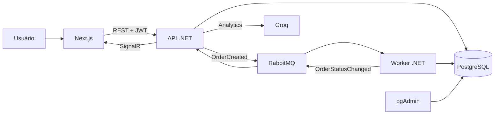

# OrdersTMB

Sistema de gestão de pedidos. O administrador cadastra clientes e produtos, enquanto clientes e administrador podem criar pedidos. Cada pedido é processado e passa pelo fluxo:

```text
Pendente → Processando → Finalizado
```

O projeto possui API em .NET 8, frontend em Next.js, PostgreSQL, RabbitMQ, Worker, SignalR e um chat de analytics usando a API da Groq.

## O que é necessário

- Docker Desktop com o Docker Engine iniciado;
- Docker Compose;
- uma chave da API da Groq para o chat.

## Como rodar

Na pasta raiz do projeto, crie o arquivo `.env` a partir do exemplo.

No PowerShell:

```powershell
Copy-Item .env.example .env
```

No Linux ou macOS:

```bash
cp .env.example .env
```

Depois, abra o `.env` e troque as chaves.

Para subir todo o ambiente pela primeira vez:

```bash
docker compose up -d --build
```

O primeiro build pode demorar um pouco porque baixa as imagens e restaura os pacotes. As migrations são aplicadas automaticamente quando a API inicia. O administrador inicial também é criado automaticamente usando `ADMIN_EMAIL` e `ADMIN_SENHA`.

Depois que as imagens já existem, basta iniciar com:

```bash
docker compose up -d
```

Quando houver alteração no código ou nas dependências, execute novamente com `--build`.

Para parar:

```bash
docker compose down
```

Os dados do PostgreSQL e RabbitMQ ficam em volumes do Docker. O comando `docker compose down -v` também remove esses volumes e apaga os dados locais, então deve ser usado com cuidado.

## Endereços

| Serviço | Endereço |
| --- | --- |
| Frontend | http://localhost:3000 |
| Swagger da API | http://localhost:5000/swagger |
| Health check | http://localhost:5000/health |
| RabbitMQ Management | http://localhost:15672 |
| pgAdmin | http://localhost:8080 |

Para registrar o banco no pgAdmin, use:

- Host: `postgres_db`
- Porta: `5432`
- Banco: valor de `POSTGRES_DB`
- Usuário: valor de `POSTGRES_USER`
- Senha: valor de `POSTGRES_PASSWORD`

## Fluxo principal

1. O usuário faz login e recebe um JWT.
2. A API valida o perfil `admin` ou `customer`.
3. Ao criar um pedido, a API calcula o valor pelo preço atual dos produtos e grava o status `Pendente`.
4. A API publica um evento `OrderCreated` no RabbitMQ.
5. O Worker recebe a mensagem, espera 5 segundos e altera o pedido para `Processando`.
6. Depois de mais 5 segundos, altera para `Finalizado`.
7. Cada mudança gera auditoria e um evento `OrderStatusChanged`.
8. A API recebe o evento e atualiza o frontend pelo SignalR.

O Worker usa atualização condicional de status e reconhecimento manual das mensagens. Isso evita aplicar a mesma transição duas vezes quando uma mensagem é entregue novamente.

## Arquitetura



## Por que essas tecnologias

- **ASP.NET Core 8:** foi usado por ter boa estrutura para APIs REST, autenticação, injeção de dependência e execução de tarefas em segundo plano.
- **Next.js com React:** organiza melhor o frontend do que uma aplicação React sem framework. Neste projeto a maior parte da interação fica em Client Components.
- **PostgreSQL:** banco relacional estável e adequado para pedidos, itens, clientes e auditoria.
- **Entity Framework Core:** simplifica o acesso aos dados e permite manter as alterações do banco em migrations versionadas.
- **RabbitMQ:** desacopla a criação do pedido do processamento. Se o Worker estiver temporariamente fora do ar, a mensagem permanece na fila.
- **Worker separado:** deixa o processamento assíncrono fora da API e facilita entender a responsabilidade de cada serviço.
- **SignalR:** entrega mudanças de status para o navegador sem fazer consultas repetidas à API.
- **JWT e BCrypt:** o JWT protege as rotas e identifica o perfil autenticado; as senhas são armazenadas como hash BCrypt.
- **Groq:** fornece uma API compatível com o SDK da OpenAI e é usada somente no backend para responder perguntas sobre os dados permitidos ao usuário.
- **Docker Compose:** deixa API, Worker, frontend, banco, mensageria e pgAdmin reproduzíveis com um único comando.

## Variáveis de ambiente

O arquivo [.env.example](./.env.example) contém todas as variáveis necessárias.

| Variável | Uso |
| --- | --- |
| `POSTGRES_USER` | Usuário do PostgreSQL |
| `POSTGRES_PASSWORD` | Senha do PostgreSQL |
| `POSTGRES_DB` | Nome do banco |
| `CRIPTOGRAFIA_CHAVE` | Chave usada na proteção dos dados pessoais |
| `JWT_CHAVE` | Chave de assinatura do JWT, com pelo menos 32 caracteres |
| `ADMIN_NOME` | Nome do administrador inicial |
| `ADMIN_TELEFONE` | Telefone do administrador inicial |
| `ADMIN_EMAIL` | Login do administrador inicial |
| `ADMIN_SENHA` | Senha do administrador inicial |
| `RABBITMQ_USER` | Usuário do RabbitMQ |
| `RABBITMQ_PASSWORD` | Senha do RabbitMQ |
| `PGADMIN_EMAIL` | Login do pgAdmin |
| `PGADMIN_PASSWORD` | Senha do pgAdmin |
| `NEXT_PUBLIC_API_URL` | Endereço público da API usado pelo navegador |
| `GROQ_API_KEY` | Chave da API usada pelo chat de analytics |


## Estrutura do projeto

```text
OrdersTMB/
├── OrdersTMB/          API, controllers, models, migrations e SignalR
├── OrdersTMB.Worker/   consumidor do RabbitMQ e atualização dos status
├── OrdersTMB.Shared/   contratos compartilhados entre API e Worker
├── frontend/           aplicação Next.js
├── docker-compose.yml  orquestração dos serviços
└── .env.example        exemplo das configurações locais
```

## Rotas principais

| Método | Rota | Descrição |
| --- | --- | --- |
| `POST` | `/auth/login` | Realiza o login |
| `GET` | `/orders` | Lista pedidos conforme o usuário autenticado |
| `GET` | `/orders/{id}` | Retorna detalhes e histórico |
| `POST` | `/orders` | Cria um pedido |
| `POST` | `/orders/analytics` | Chat de analytics com resposta em streaming |
| `GET` | `/products` | Lista produtos ativos |
| `POST` | `/products` | Cadastra produto como administrador |
| `GET` | `/customers` | Lista clientes como administrador |
| `POST` | `/customers` | Cadastra cliente como administrador |
| `GET` | `/health` | Retorna a situação dos serviços |

As rotas protegidas usam o cabeçalho:

```http
Authorization: Bearer SEU_TOKEN
```
